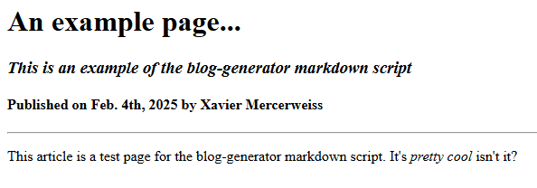

 # bloggen
 Short for ___Blog___ ***Gen***erator.
 
 A Python program which converts a custom markdown document into a static HTML blog entry.

 This program is meant to be run locally on your web server in order to generate static
 HTML content based on a series of mardown documents containing the entry's formatting.
 It must be provided an HTML template for both your blog index page and each entry's 
 webpage. The given markdown document is only converted into the HTML content of the
 entry itself. (i.e. title, paragraphs, etc.)

 ## Overview
 This program will generate an index page, listing the titles of each entry in order,
 and generate the webpages for each entry. The index will automatically link to each entry
 from its title. Templates must be given, via the `main.conf` file, for both the index and
 the entries. (One template will be used by all entries.)

 Each template must be a valid HTML document with `#CONTENT#` in place of where the content
 will be listed. The index's content will be an ordered list of links to the entries,
 while each entry's content will be the HTML rendered from its associated markdown 
 file. The structure of this markdown is covered in the sections below.

 To execute the program, ideally on your webserver through SSH, download this project and call...
 ```bash
 python3 main.py <markdown files>
 ```

 For instance, to convert all `.blog` files in the current directory, you would call...
 ```bash
 python3 main.py ./*.blog
 ```

 Please note that you may need to substitute `python3` for the appropriate command for your
 server's setup, and all paths must be changed to reflect your server's environment. It's 
 suggested that you alias the command needed to feed the contents of an `entries/` directory 
 into the program automatically.

 ## Metadata
 Below is a table of tokens which represent metadata within the defined markdown script.

 Each value may be set by beginning a new line with the token, followed by the assigned data.
 Each value may be used by simply placing its token in any portion of text.

| Token | Value |
| - | - |
| #! | The entry's title, "Untitled" by default |
| #? | The entry's date* |
| #$ | The entry's description, blank by default |
| #@ | The entry's author, "Anon" by default |

*NOTE: When left unset, the date of the entry will be defined as the date the program
is converting the markdown document into HTML, _not_ necessarily the date it was written.
All dates must be entered in YYYY-MM-dd format.

## Operations
Below is a table of tokens which represent operations/formatting within the defined 
markdown script.

| Token | Arguments | Operation |
| - | - | - |
| #1 through #6 | _text_ | Encloses the given text with HTML tags h1 through h6, respectively |
| #/ | _text_ | Italicizes the given text |
| #_ | _text_ | Bolds the given text |
| #= | _link_, _text_ | Creates an anchor tag with an href of _link_ and contents of _text_ |
| #I | _link_, _text_ | Embeds an image into the webpage with _text_ as alt text |
| #+ | __None__ | Opens a new p tag |
| #- | __None__ | Closes the last p tag | 
| #~ | __None__ | Replaced with an hr tag |
| #n | __None__ | Replaced with a br tag |
| ## | __None__ | Comments out the entire line |

Each operation must be used by beginning a new line with the token followed by a space,
then space-deliminated arguments. Operations may be piped by placing several operators
together in the order they will be performed.

For instance, the following line...
```
#1/ Italic Header!
```

...will be rendered as...
```html
<em><h1>Italic Header!</h1></em>
```

## Example
Below is an example of the defined markdown script and resulting page contents.

```
#! An example page...
#$ This is an example of the blog-generator markdown script
#? 2025-02-04
#@ Xavier Mercerweiss

#1 #!
#3/ #$
#4 Published on #? by #@

#~

#+
This article is a test page for the blog-generator markdown script. It's
#/ pretty cool
isn't it?
#-
```

This document would be converted to the following HTML.

```html
<h1>An example page...</h1>
<h3><em>This is an example of the blog-generator markdown script</em></hr>
<h4>Published on Feb. 4, 2025 by Xavier Mercerweiss</h4>

<hr>

<p>
   This article is a test page for the blog-generator markdown
   script. It's <em>pretty cool</em> isn't it?
</p>
```

And is, without CSS, rendered as the following image.



## Configuration
The script's `main.conf` file must be set before entries may be generated. It's assumed that the script
is running directly on your web server, so all "local paths" are the relative paths to the content
on the server from the script. Below is a table of all needed configuration values.

| Key | Value |
| - | - |
| _entry_domain_format_ | The link through which entries will be referenced. E.g. for entries linked at `my.site/blog/1` and `my.site/blog/2`, this would be set to `my.site/blog`|
| _entry_filename_format_ | Given a markdown file's name, this format sets the name of the HTML file it generates. List `*` in place of the name of the markdown file in this format. For example, to convert `ten` to `number_ten.html`, set this value to `number_*.html`|
| _index_path_ | The local path to the entry index page. (such as `./blog/index.html`) |
| _index_template_ | The local path to the template for the entry index page. (such as `./templates/blog_index.html`) |
| _entry_dest_ | The folder within which entry webpages will be saved. (such as `./blog/entries`) |
| _entry_template_ | The local path to the template for entry webpages. (such as `/templates/blog_entry.html`)
| _date_format_ | The format for _displaying_ dates, based on the [Python](https://strftime.org/) standard. Note that all dates listed in the markdown must follow the format `YYYY-MM-dd` |
| _newest_first_ | Boolean, should entries be listed newest-first in the index? |
| _expand_tabs_ | Boolean, should tabs be converted to spaces? Tabs are assumed to be 4 spaces. |
